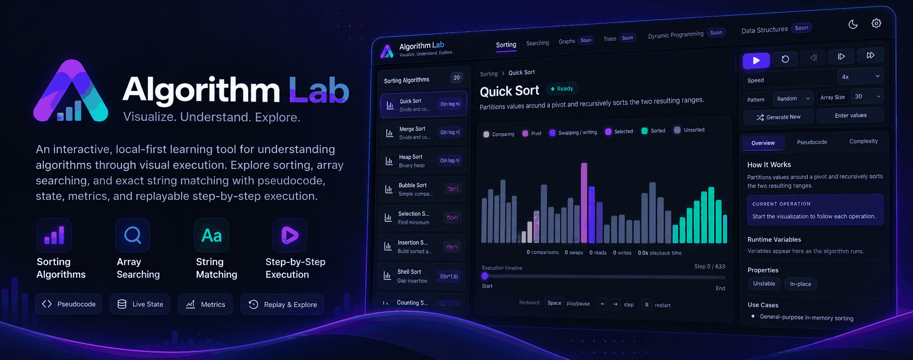

<p align="center">
  
</p>

# Algorithm Lab

<p align="center">
  <a href="https://rezamousavi98.github.io/algorithm-lab/">
    
  </a>
</p>

An interactive, local-first learning tool for understanding algorithms through visual execution. Explore sorting, array, string, hash-table and tree searching with pseudocode, state, metrics, and replayable step-by-step execution.

## Getting started

Requirements: Node.js 20.19+ or 22.12+ and npm.

```sh
npm install
npm run dev
```

Vite prints the local URL after the development server starts. To check the production build and lint the project:

```sh
npm run build
npm run lint
```

To serve the production build locally, run `npm run build` followed by `npm run preview`.

## Using the app

- Choose Sorting or Searching in the top navigation, then select Arrays, Strings, Hash Tables or Trees in the sidebar. The remaining top-level categories are marked Soon.
- Array Search accepts a finite numeric target and values; sorted-only algorithms offer **Sort a copy**. String Search accepts text and a pattern, and reports every overlapping match by Unicode code point position. Hash Tables builds a table from safe-integer `key:value` pairs before lookup; Separate Chaining, Linear Probing and Double Hashing show collisions and lookup probes.
- Tree Search offers Binary Search Tree Lookup, preorder Depth-First Search and level-order Breadth-First Search. BST insertion order determines its shape; general trees use `key:value` tokens in level order with `null` child slots. Duplicate keys return the first match in the selected traversal.
- Sorting can generate random, nearly sorted, reversed, or few-unique data, or accept comma-separated values.
- Play, pause, step backward or forward, seek through the timeline, adjust playback speed, reset, or jump to the end.
- Follow the current operation, algorithm variables, pseudocode, operation metrics, and complexity details in the learning inspector.
- Switch between dark and light themes. Theme, speed, array size, category, search mode, and each search mode's selected algorithm are saved in browser local storage.

Counting Sort accepts safe integers with a bounded distinct-value range. Radix Sort accepts safe integers, including negative values. Input validation displays algorithm-specific constraints before execution.

## Architecture

The app keeps algorithm execution independent from React presentation:

```text
Algorithm definitions and registry
              ↓
       Semantic events
              ↓
 Reducer and execution history
              ↓
 Playback controller and React views
```

- `src/domain/algorithms/` contains shared contracts, the sorting registry, algorithm definitions, input creation, and input validation.
- `src/domain/simulation/` contains the pure event reducer, execution sessions, snapshots, and derived metrics.
- `src/domain/preferences/` defines preference validation and a persistence interface; `src/infrastructure/` implements browser storage.
- `src/features/sorting/` composes sorting input controls, a simulation-state-only visualizer, and synchronized learning panels. `src/features/searching/` owns the separate array and string search inputs, workspaces, and state views.
- `src/domain/playback/` defines pure playback transitions and the generic timeline interface; `src/features/playback/` owns the timer, keyboard adapter, playback controls, and timeline slider.
- `src/features/workspace/` provides the shared workspace layout, right-side action container, accessible inspector tabs, and learning-content views. Category components supply their own inputs and visualization.
- `src/styles/` separates shell, controls, visualization, learning, recovery, and responsive styles. Theme and algorithm colors use shared tokens in `src/styles/theme.css`.
- `src/components/` contains shared UI and workspace recovery components.

Algorithm definitions emit semantic events into a deterministic execution history. The playback hook derives any timeline position from that history, so stepping backward and seeking do not rerun the algorithm. UI components render simulation state without owning algorithm logic or timers.

## Current sorting catalog

The app includes Bubble, Selection, Insertion, Merge, Quick, Heap, Shell, Counting, Radix, Cocktail Shaker, Comb, Gnome, Odd–Even, Cycle, Pancake, Binary Insertion, Bottom-up Merge, Bucket, TimSort, and Introsort.

Bucket Sort accepts finite numeric values and uses a bounded set of buckets. Counting Sort requires safe integers with a bounded distinct-value range. Radix Sort requires safe integers, including negative values. Each definition provides its own validation and learning metadata.

Array Search includes Linear, Binary, Jump, Exponential, Interpolation, and Fibonacci Search. Linear Search accepts unsorted data; the other five require ascending input. It uses zero-based indices and returns any matching index when duplicates exist. String Search includes Naive String Search, Knuth–Morris–Pratt, Boyer–Moore using the bad-character rule, and Rabin–Karp. It uses Unicode code point positions and reports overlapping matches. Hash Tables includes Separate Chaining, Linear Probing and Double Hashing lookup. Probes count bucket or slot visits separately from entry-key comparisons; open-addressing views show their strategy-specific probe sequence, wraparound and deleted-slot traversal. Double Hashing's secondary hash controls slot probes and is unrelated to Rabin–Karp's rolling hash. Production build and lint pass. Browser review of the hash workspace and the previously refactored cross-category layout remains pending.

## Extension boundaries

Add a sorting definition with its executor, short description, display order, and educational metadata, then register it in `domain/algorithms/sorting/index.ts`. Sidebar and learning views consume metadata without importing individual algorithms.

Each category supplies a `Timeline<TState>` (`totalSteps`, `getState`) and its own renderer. The generic playback controller does not import category state or snapshot storage. Key each workspace by execution identity to start a fresh playback session when input or algorithm changes.

Playback time measures elapsed wall-clock time while playing. Pause, seek, and manual stepping do not add idle time; restarting or replaying clears it. It is distinct from execution step and operation counts.

## Changing the primary color

Edit `--brand-color` in `src/styles/theme.css` (currently `#684fff`). Button gradients, links, logo, selection backgrounds, navigation highlights, timeline accents, focus rings, and glow effects derive from this one value in both themes. Light-mode overrides adjust contrast rather than defining a separate brand color.

The `--primary-*` and `--accent-*` variables can be adjusted for finer control. Neutral surfaces and semantic algorithm/status colors are independent. Check text contrast when choosing a substantially lighter brand color.
